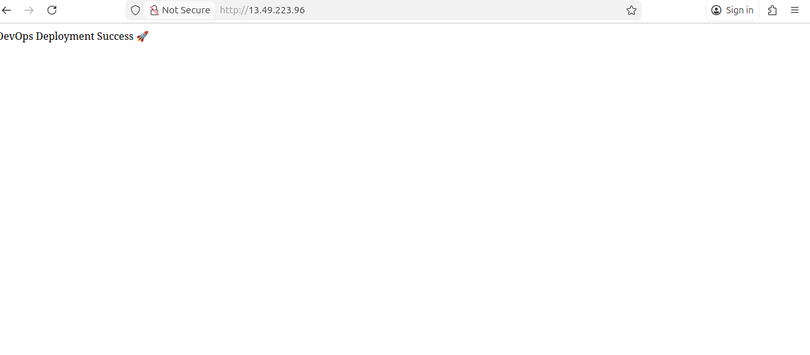

# DevOps App - Production Deployment
## Aplication Screenshot

## Overview
This is a Node.js application deployed on **AWS EC2** using **Docker** and **Nginx Reverse Proxy**.  
It is **Production-ready** and managed via Docker container.

---

## Architecture
- **AWS EC2** - Hosting server
- **Docker** - Containerized Node.js App
- **Nginx** - Reverse proxy to expose app on Port 80
- **PM2 / Docker restart** - Ensures the app is always running

[Public IP] --> Nginx Port 80 --> Docker Container 3000 --> Node.js App


---

## Prerequisites
- AWS EC2 Instance (Ubuntu)
- Docker installed
- Nginx installed

---

## Steps to Deploy

### 1️⃣ Clone the repository
```bash
git clone <repo-link>
cd <project-folder>

### 2 Build Docker Image

docker build -t devops-app-test .

3️⃣ Run Container

docker run -d -p 3000:3000 devops-app-test

4️⃣ Configure Nginx Reverse Proxy

sudo nano /etc/nginx/sites-available/devops-app

#Paste:
server {
    listen 80;
    server_name _;

    location / {
        proxy_pass http://localhost:3000;
        proxy_http_version 1.1;
        proxy_set_header Upgrade $http_upgrade;
        proxy_set_header Connection 'upgrade';
        proxy_set_header Host $host;
        proxy_cache_bypass $http_upgrade;
    }
}

#Enable site and restart Nginx:
sudo ln -s /etc/nginx/sites-available/devops-app /etc/nginx/sites-enabled/
sudo nginx -t
sudo systemctl restart nginx

5️⃣ Test Aplication

#Open in browser:

http://<EC2-public-IP>

#Optional: Keep Container Running After Restart
docker ps           # get container_id
docker update --restart unless-stopped <container_id>


--

---

# ⚡ Commands Copy-Paste (Production Deployment)

```bash
# 1. SSH to EC2
ssh -i key.pem ubuntu@<EC2-public-IP>

# 2. Clone repo
git clone <repo-link>
cd <project-folder>

# 3. Build Docker image
docker build -t devops-app-test .

# 4. Run container
docker run -d -p 3000:3000 devops-app-test

# 5. Setup Nginx
sudo nano /etc/nginx/sites-available/devops-app
# paste reverse proxy config

sudo ln -s /etc/nginx/sites-available/devops-app /etc/nginx/sites-enabled/
sudo nginx -t
sudo systemctl restart nginx

# 6. Keep container running after restart
docker ps
docker update --restart unless-stopped <container_id>


